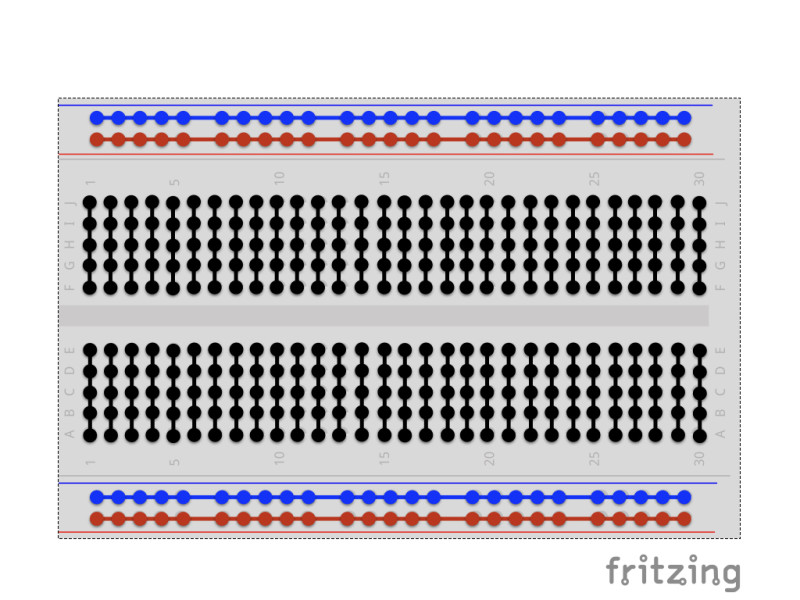

# Raspberry PI setup
1. Install the os, [here is a guide](https://thepi.io/how-to-install-raspbian-on-the-raspberry-pi/)
2. Hook up the monitor, keyboard and mouse.

---
# Bread Board
Bread boards are difficult to understand at first, but the pattern is simple

 - The blue rails connect all the way across.  Each rail is separate from the other.
 - The red rails connect all the way across.  Each rail is separate from the other.
 - The black rails connect all the way down.  Each rail is separate from the other.
 
